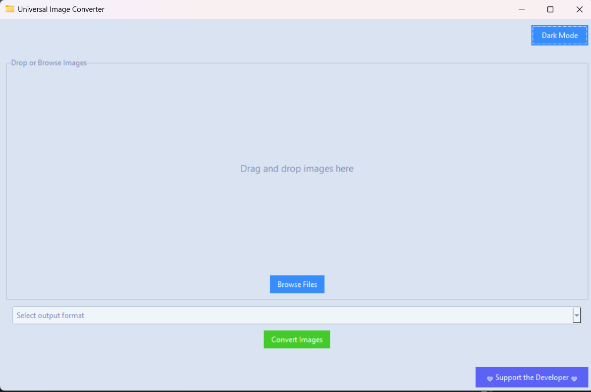
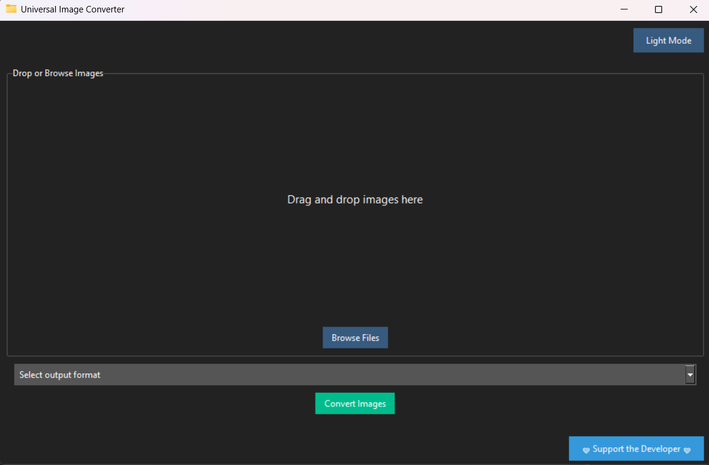

# Universal Image Converter

**A simple and sleek cross-platform desktop tool to convert image files between multiple formats.**

---

## ✨ Features

- ✅ Drag-and-drop or file browser support  
- 🖼️ Convert between **JPG, PNG, WEBP, TIFF, BMP, HEIC**, and more  
- 📁 Batch folder conversion with custom output naming  
- 🌓 Toggle between **dark and light themes**  
- 💻 Built-in support for both **GUI and CLI**  
- 📦 Windows-compatible `.exe` (portable or installer)  
- 🐍 Built with Python, Tkinter, ttkbootstrap, and Pillow  

---

## 🖼️ Interface Preview

**App Icon**  


**Light Theme Screenshot**  


**Dark Theme Screenshot**  


---

## 🚀 Download & Run

Get the latest version from the [Releases page](https://github.com/Jesikurr/Universal-Image-Converter/releases).

### 🖱️ Run the GUI (Windows)

- Launch `Image Converter.exe` 
  *(If SmartScreen appears, click **More Info > Run Anyway**)*

### 🐍 Run via Python

From your terminal or command prompt:

```bash
# Start the GUI
python gui.py
```

---

## 🧪 Command-Line Interface (CLI)

Convert images directly from the terminal — perfect for automation or scripting.

### 📸 Convert a Single Image

```bash
python cli.py --input path/to/image.heic --output-format jpg
```

### 🗂️ Batch Convert a Folder

```bash
python cli.py --input-folder input_images/ --output-format png --output-folder output_images/
```

### 📄 List Supported Output Formats

```bash
python cli.py --list-formats
```

### 📘 View Help

```bash
python cli.py --help
```

---

## ❤️ Support the Developer

If this tool saves you time, consider supporting continued development:  
**[https://cash.app/$Jesikurr](https://cash.app/$Jesikurr)**

